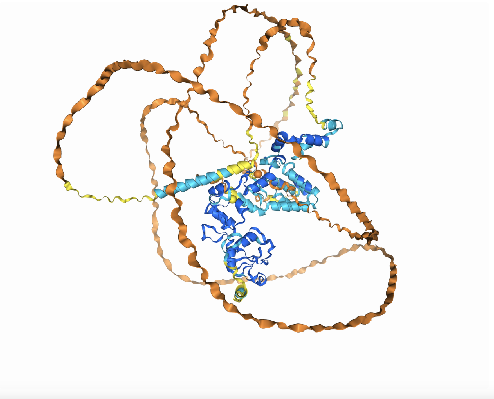

# znf598

## znf598とは？

ubiquitin ligase活性を持ち、タンパク質のユビキチン化においてE3タンパク質の役割を果たすタンパク質。RQC機構のなかで衝突リボソームをユビキチン化する。詳細は後述する。

## 遺伝子配列と系統

### 遺伝子配列

参照：[ZNF598(Homo sapiens)](https://www.ncbi.nlm.nih.gov/gene/90850)

配列情報(mRNA)

> Homo sapiens ZNF598 isoform 3, mRNA
GGAAGGGGCGGGCCCGCCGGGAGCCAGGCCGCGCGGCGCCGCGCCGGCCGAGAGGGGGCCGGATCCCGGACCATGGCGGCGGCGGGGGGCGCCGAGGGGCGGCGCGCGGCCCTGGAGGCGGCGGCGGCGGCAGCTCCTGAGCGGGGAGGCGGGAGCTGCGTGCTGTGCTGCGGAGACCTGGAGGCCACGGCGCTGGGCCGCTGCGACCACCCGGTGTGCTACCGCTGCTCTACCAAGATGCGGGTGCTCTGCGAGCAGCGCTACTGCGCCGTGTGCCGCGAGGAGCTGCGCCAGGTGGTCTTTGGGAAGAAGCTTCCTGCCTTTGCCACCATCCCCATCCACCAGCTGCAGCATGAGAAGAAATATGATATCTACTTTGCAGATGGAAAGGTGTACGCATTGTACAGGCAGCTGCTGCAGCACGAGTGCCCGCGGTGCCCCGAGCTGCCACCTTTCAGCCTCTTCGGGGACCTGGAGCAGCACATGCGGAGGCAGCATGAGCTCTTCTGCTGCCGTCTGTGCCTCCAGCACCTCCAGATCTTCACATATGAGCGCAAGTGGTACTCGCGCAAGGACCTGGCCCGGCATCGCATGCAGGGTGACCCCGATGACACGTCGCACCGTGGGCACCCGCTCTGCAAGTTCTGTGACGAGCGCTACCTGGACAATGATGAGCTGCTTAAGCACCTGCGCCGCGACCACTACTTCTGCCACTTCTGCGACTCGGACGGGGCCCAGGACTACTACAGCGACTATGCCTACCTGCGTGAGCACTTCCGGGAGAAGCACTTTCTGTGTGAGGAAGGCCGCTGCAGCACGGAGCAGTTCACCCACGCCTTCCGCACCGAGATCGACCTCAAGGCCCACAGGACGGCCTGCCACAGTCGCAGCCGCGCCGAGGCACGCCAGAACCGCCACATCGACCTGCAGTTCAGCTACGCGCCACGGCACTCGCGCCGGAACGAGGGGGTCGTTGGTGGCGAAGACTACGAGGAGGTGGACAGGTACAGCCGCCAGGGCCGAGTGGCCCGGGCTGGCACTCGCGGAGCCCAGCAGAGCCGCCGAGGAAGCTGGAGGTACAAAAGGGAAGAAGAGGACCGAGAAGTAGCAGCTGCTGTCCGGGCCTCCGTGGCCGCACAGCAGCAGGAGGAGGCTCGCAGGAGTGAGGATCAGGAGGAAGGCGGTAGGCCCAAGAAGGAGGAGGCAGCGGCGCGGGGACCTGAGGATCCCCGTGGCCCCCGGCGCTCACCCCGGACTCAGGGCGAAGGCCCAGGCCCCAAGGAAACCTCGACAAATGGTCCTGTAAGCCAAGAAGCCTTCTCGGTGACAGGCCCAGCCGCCCCAGGCGCCCTCCCACCACCCAGCCCGAAGCTCAAGGACGAAGACTTCCCCAGCCTCTCTGCCTCCACTTCCTCCTCCTGCTCCACTGCAGCAACCCCGGGCCCTGTGGGGTTGGCGCTGCCGTACGCCATCCCTGCCAGAGGCAGGAGTGCCTTCCAGGAGGAGGACTTCCCCGCCCTGGTGTCCTCGGTGCCCAAGCCTGGCACCGCCCCCACCAGCCTTGTCTCTGCCTGGAACAGCAGCAGTAGCAGCAAGAAGGTAGCACAGCCCCCACTCTCGGCGCAGGCTACCGGCAGCGGCCAGCCCACCAGGAAGGCTGGGAAGGGGAGCAGGGGCGGCAGGAAGGGCGGCCCGCCCTTCACACAGGAGGAGGAGGAGGACGGCGGCCCGGCCCTGCAGGAGCTTCTGAGCACACGCCCCACGGGCTCCGTCTCCTCCACACTGGGGCTGGCCTCCATCCAACCCTCTAAAGTTGGGAAGAAGAAGAAAGTGGGCTCGGAGAAGCCAGGCACCACATTGCCACAGCCCCCGCCCGCTACCTGTCCCCCAGGGGCTTTGCAGGCCCCGGAAGCTCCTGCCAGCAGAGCCGAGGGGCCAGTTGCCGTCGTCGTTAATGGACACATGGAGGGCCCGGCCCCTGCTCGGAGTGCCCCCAAGGAACCCCCTGGGCTCCCAAGGCCCCTGGGGTCCTTCCCCTGCCCCACGCCACAGGAGGACTTCCCAGCGCTCGGCGGCCCCTGCCCACCCCGGATGCCGCCGCCCCCAGGCTTCAGCGCTGTGGTGCTCCTGAAGGGCACGCCTCCCCCACCCCCGCCGGGCCTGGTGCCCCCAATCAGCAAGCCGCCCCCTGGCTTCTCTGGCCTTCTGCCTAGCCCCCACCCGGCCTGTGTCCCCAGCCCCGCCACCACCACCACCACAAAAGCACCCAGGCTGCTGCCTGCCCCACGGGCGTACCTAGTCCCCGAGAACTTCCGGGAGAGGAACCTTCAGCTCATCCAGTCCATCAGGGACTTCCTGCAGAGCGACGAGGCCCGCTTCAGCGAGTTCAAGAGCCACTCAGGGGAGTTCAGACAGGGCCTGATCTCCGCAGCCCAGTATTACAAGAGTTGCCGGGACCTGCTGGGGGAGAATTTCCAGAAGGTCTTTAATGAGCTGCTGGTCCTGCTGCCCGACACGGCCAAGCAGCAGGAGCTCCTGTCTGCACACACGGACTTCTGCAACCGCGAGAAGCCTCTGAGCACCAAGTCCAAGAAGAACAAGAAGAGCGCGTGGCAGGCCACCACCCAGCAGGCGGGCCTGGACTGCCGTGTGTGCCCCACCTGCCAGCAGGTGCTCGCGCATGGCGATGCCAGCAGCCACCAGGCGCTGCATGCTGCCCGGGACGACGACTTCCCCTCCCTGCAAGCCATCGCCAGGATCATCACGTAGCTCCCGCCAGCGTGGCCAGAGCTGTCGCACCGTGAGCGTCCTTCCTCCTTCCTCTCCGGGCTGCCAGGCAGCCAGGTAAGGCCTGGTGAGGCCACTTGGCCTCTTGGTTGGCCAGGCCCACCAGGAAGTCACCAGGACAGTCCACCCGCCCTGTTGGCACACTCAAGCGGGAGTCCACCCCTGCCTCAGTGGTGGGCCAGTCTCGGTTTGCATTCTTGTGCTTTTGGGAGGTGCCAGGGGAGGGAAGGGCTGGGATGCTGGGACCTGTTGTTGCTGGCAAAGCCAGAGGTCACAGTGGCCTGATCTGGGCCCTCCCAAAGCTGAGGGCTGCAGCCCGTGGGGCCTCAGAGCTGAAAGCTGCGGCGCCACTGGTGCCAGAGTCAGATGTCACAGATGTGTTGTGTAAACAGTTGGCTGTTTCATGCTTCAAGAATGTTCAGGATTAAAAGCAGACAAGAAATTGTGCTACTTGAAGTTGAATCTTTTTATGAGACAAGCTGAATCTGGGATCTCAAATTGCCTCTGACCTTTTATAAGACAGTTTATCTTCAAATAAATTTATTTTGCAATACCACGCA

配列情報(タンパク質)

> Homo sapiens ZNF598 isoform 3, Protein
MAAAGGAEGRRAALEAAAAAAPERGGGSCVLCCGDLEATALGRCDHPVCYRCSTKMRVLCEQRYCAVCREELRQVVFGKKLPAFATIPIHQLQHEKKYDIYFADGKVYALYRQLLQHECPRCPELPPFSLFGDLEQHMRRQHELFCCRLCLQHLQIFTYERKWYSRKDLARHRMQGDPDDTSHRGHPLCKFCDERYLDNDELLKHLRRDHYFCHFCDSDGAQDYYSDYAYLREHFREKHFLCEEGRCSTEQFTHAFRTEIDLKAHRTACHSRSRAEARQNRHIDLQFSYAPRHSRRNEGVVGGEDYEEVDRYSRQGRVARAGTRGAQQSRRGSWRYKREEEDREVAAAVRASVAAQQQEEARRSEDQEEGGRPKKEEAAARGPEDPRGPRRSPRTQGEGPGPKETSTNGPVSQEAFSVTGPAAPGALPPPSPKLKDEDFPSLSASTSSSCSTAATPGPVGLALPYAIPARGRSAFQEEDFPALVSSVPKPGTAPTSLVSAWNSSSSSKKVAQPPLSAQATGSGQPTRKAGKGSRGGRKGGPPFTQEEEEDGGPALQELLSTRPTGSVSSTLGLASIQPSKVGKKKKVGSEKPGTTLPQPPPATCPPGALQAPEAPASRAEGPVAVVVNGHMEGPAPARSAPKEPPGLPRPLGSFPCPTPQEDFPALGGPCPPRMPPPPGFSAVVLLKGTPPPPPPGLVPPISKPPPGFSGLLPSPHPACVPSPATTTTTKAPRLLPAPRAYLVPENFRERNLQLIQSIRDFLQSDEARFSEFKSHSGEFRQGLISAAQYYKSCRDLLGENFQKVFNELLVLLPDTAKQQELLSAHTDFCNREKPLSTKSKKNKKSAWQATTQQAGLDCRVCPTCQQVLAHGDASSHQALHAARDDDFPSLQAIARIIT

### 相同遺伝子

protein BLASTを用いてマウス(Mus musculus)、ニワトリ(Gallus gallus)、ゼブラフィッシュ(Danio rerio)、ショウジョウバエ(Drosophila melanogaster)、線虫(Caenorhabditis elegans)、分裂酵母(Schizosaccharomyces pombe)、出芽酵母(Saccharomyces cerevisiae)における相同遺伝子の配列を検索した。すると、相同遺伝子はマウス、ニワトリ、ゼブラフィッシュで見つかった。脊椎動物に広く保存されている遺伝子か？：少なくとも哺乳動物には保存されている遺伝子である[1]。
また、残りの線虫と酵母についても共通する部分があり、具体的にはRING finger domain(C3HC4 zinc finger domain)が保存されているのが確認できた。RING finger domainは酵母などではHel2のdomainとなっている[2]。  

相同遺伝子の見つかったタンパク質について、multifastaファイルを作成、Clustal Wを用いて系統樹を作成した(fig.1)。

fig.1 znf598の系統樹

## タンパク質の機能
まず、znf598が機能するRQC経路について概説する。
### RQC(Ribosome-associated Quality Control)[3]
翻訳停止したタンパク質を排除するために、哺乳類は複数の機構を持っている。そのうちの一つがRQCで、翻訳中に伸長を停止、衝突リボソームを形成したリボソームおよびタンパク質をユビキチン化、RQT(Ribosome Quality control Trigger)複合体で認識し、40s/60sサブユニットに分解する。翻訳途中のタンパク質は、ユビキチン-プロテアソーム系で完全に分解される。また、停滞を引き起こしたmRNAはNGD(no-go decay)経路によって分解される。詳細には以下のような機構である。

1. 衝突リボソーム(disome、trisome[4])の形成
ノンストップmRNA[^1]のポリA鎖、連続する非最適コドン[^2] 、特異的な新生鎖による翻訳アレスト[6]などによって、タンパク質の翻訳は停止されうる。翻訳が停止すると、後続のリボソームが衝突してdisome、trisomeが形成される。これらの原因の中でメジャーなのはポリA鎖によるものらしい。
2. リボソームのユビキチン化
disomeやtrisomeをHel2(ヒトznf598)が認識し、ユビキチン標識する。具体的には、リボソームタンパク質uS10がK63型ユビキチン鎖で修飾される。
3. 40s/60sへの解離
衝突リボソームは、ユビキチン標識(K63鎖)によってRQT複合体のCu3(ヒトASCC2)サブユニットに認識される。すると、衝突リボソームの40sサブユニットがRQT複合体のSlh1(ヒトASCC3サブユニット)[^3]によってC1状態からC2状態に状態変化、不安定化し、40sサブユニットと60sサブユニットに解離する。[7]
4. 異常タンパク質のユビキチン化
60sサブユニットは、LTN1によってペプチジルtRNAのユビキチン化を受ける。ここで付加されるユビキチン鎖はK48鎖であり、プロテアソーム分解シグナルである。
5. tRNA切断
異常タンパク質のtRNAをリボソームから解離させるために、Vms1(ヒトANKZF1)がtRNA部位を切断する。
6. 異常タンパク質分解
ユビキチン標識異常タンパク質はCdc48/Npl4によってプロテアソームに送られる。Cdc48は6量体のリング状構造を持ったATPaseタンパク質で、標的タンパク質をATP加水分解依存的にアンフォールディングする[8]。補因子Npl4はユビキチンK48鎖を認識する。

以上の仕組みにおいて、Ltn1によるユビキチン化が起こらない場合、60sサブユニットの異常タンパク質末C端にCATテイル(C-terminal alanine-threoneine tail)がmRNA非依存的に付加される。CATテールは、Ltn1によるユビキチン転移反応の基質となるため、RQCの保険の様な役割を果たす。CATテイル付加の機構は原核生物にも保存されており、枯草菌RQC経路でのRqcHによるAla連続配列の付加は分解のシグナルになっている[9]。
一方、CATテイルタンパク質が蓄積すると、凝集体を形成し、神経細胞の形成阻害やプログラム細胞死を引き起こすようだ。[10]

また、最近の研究で、znf598の下流で働いているタンパク質であるGIGYF2 、EIF4E2が翻訳開始を阻害、異常タンパク質の蓄積を防いでいることが明らかになった[11]。

### znf598/Hel2の機能
以上に書いたようなRQCの機構の中で、主に衝突リボソームのユビキチン化をしているのがznf598である。znf598はE3 ユビキチンリガーゼであるから、E1タンパク質が活性化し、E2タンパク質が結合していたユビキチンを衝突リボソームに転移させる。この際、ユビキチン化の標識となるのは、disome、trisomeに特異的な40s-40s構造であると推定されている。

Hel2はznf598の無脊椎動物におけるホモログで、znf598とほとんど同様の役割を果たす。さらに、Hel2についてはRQC経路とは独立して、過剰なヒストンタンパク質のポリユビキチン化とも関連していることが報告されている[12] (この辺は詳しく調べてないのでそのうち勉強します)。

これら遺伝子の欠損は、タンパク質凝集、ひいては神経系疾患につながるとされている。

## タンパク質の構造

### ドメイン構造
N末端側にzinc fingerがあり、配列の真ん中に大きなdisorder領域があった。znf598のzinc fingerは、亜鉛イオンを２つ含むC3HC4タイプの、いわゆるRING fingerであり、E2酵素および40s-40s構造を認識する。

### 立体構造

alphafold3を用いて構造予測を行った。alphafold2と予測結果はほぼ同じであるが、Znイオンとの相互作用について予測することができた。以下の画像に示すように、Znイオン(画像中央、黄色とオレンジの球)が中心にあるのがzinc finger domainであるのだろう。

## 翻訳後修飾と発現量
znf598の部位別発現量を、UCSC Genome Browserを用いて調査した。すると、小脳、肺に多く発現し、逆に精巣にはほとんど見られなかった。また、ヒストン修飾をみても発現量との相関はあまり見られなかった。

## NGSデータの解析
RQC経路/NGD経路における4EHP-GIGYF1/2複合体の役割について研究した研究[13]のデータを用い、iDEP2.0を用いて解析を行なった。すると、Complement and coagulation cascadesなど複数の経路に関与していることが示唆された。以下の表は有意水準0.01とした際の関係する経路である(KEGGにはmRNA regulation関係のpathwayが登録されていないからそれは出てきていないのかな)。免疫系の経路がいくつか提案されているのは、K63ユビキチン化が免疫反応においても何かしらの標識になっているからかもしれない。

pathways

| Pathway | Direction | NES | Genes | adj.Pval |
|--|--|--|--|--|
| [Complement and coagulation cascades](http://www.genome.jp/kegg-bin/show_pathway?hsa04610) | Up | 0.681 | 50 | 3.50E-05 |
| [Hypertrophic cardiomyopathy](http://www.genome.jp/kegg-bin/show_pathway?hsa05410) | Up | 0.6126 | 70 | 1.10E-04 |
| [Rheumatoid arthritis](http://www.genome.jp/kegg-bin/show_pathway?hsa05323) | Up | 0.61 | 66 | 1.70E-04 |
| [Dilated cardiomyopathy](http://www.genome.jp/kegg-bin/show_pathway?hsa05414) | Up | 0.5896 | 75 | 2.00E-04 |
| [Viral protein interaction with cytokine and cytokine receptor](http://www.genome.jp/kegg-bin/show_pathway?hsa04061) | Up | 0.6521 | 50 | 2.30E-04 |
| [Inflammatory bowel disease](http://www.genome.jp/kegg-bin/show_pathway?hsa05321) | Up | 0.6443 | 42 | 1.90E-03 |
| [Graft-versus-host disease](http://www.genome.jp/kegg-bin/show_pathway?hsa05332) | Up | 0.7592 | 19 | 2.10E-03 |
| [Antigen processing and presentation](http://www.genome.jp/kegg-bin/show_pathway?hsa04612) | Up | 0.6058 | 48 | 2.50E-03 |
| [Bile secretion](http://www.genome.jp/kegg-bin/show_pathway?hsa04976) | Up | 0.5947 | 53 | 2.50E-03 |
| [Type I diabetes mellitus](http://www.genome.jp/kegg-bin/show_pathway?hsa04940) | Up | 0.6904 | 23 | 6.80E-03 |
| [Type II diabetes mellitus](http://www.genome.jp/kegg-bin/show_pathway?hsa04930) | Up | 0.6177 | 37 | 6.80E-03 |
| [Nitrogen metabolism](http://www.genome.jp/kegg-bin/show_pathway?hsa00910) | Up | 0.7837 | 13 | 7.70E-03 |
| [Malaria](http://www.genome.jp/kegg-bin/show_pathway?hsa05144 ) | Up | 0.6337 | 31 | 7.70E-03 |

  
また、Deseq2を用いて発現変動量について調べ、その有意差が多い遺伝子1000個のリストをpantherでGo term解析した。すると、DEGsが関わる経路として、mRNA結合の制御などmRNAに関連する経路の発現量が増加していた。これらは、ZNF598をサイレンシングした埋め合わせとして発現量が増加するように制御されたと考えることができる。

## 参考資料
### 文献
1. [Juszkiewicz, Szymon, and Ramanujan S. Hegde. "Initiation of quality control during poly (A) translation requires site-specific ribosome ubiquitination." Molecular cell 65.4 (2017): 743-750.](https://doi.org/10.1016/j.molcel.2016.11.039)
2. [Singh, Rakesh Kumar, et al. "Novel E3 ubiquitin ligases that regulate histone protein levels in the budding yeast Saccharomyces cerevisiae." PLoS One 7.5 (2012): e36295.](https://doi.org/10.1371/journal.pone.0036295)
3. [稲田利文. "タンパク質恒常性維持の鍵となるリボソーム動態制御と異常翻訳品質管理機構." Journal of Japanese Biochemical Society 93.5 (2021): 723-732.](https://doi.org/10.14952/SEIKAGAKU.2021.930723)
4. [Ikeuchi, Ken, et al. "Collided ribosomes form a unique structural interface to induce Hel2‐driven quality control pathways." The EMBO journal 38.5 (2019): e100276.](https://doi.org/10.15252/embj.2018100276)
5. [Hia, Fabian, et al. "Codon bias confers stability to human mRNA s." EMBO reports 20.11 (2019): e48220.](https://doi.org/10.15252/embr.201948220)
6. [田口英樹. "新生鎖に依存した翻訳の一時停止と途中終了." 生物工学会誌/日本生物工学会 編 97.8 (2019): 485-488.](https://www.sbj.or.jp/wp-content/uploads/file/sbj/9708/9708_tokushu_2.pdf)
7. [Best, Katharina, et al. "Structural basis for clearing of ribosome collisions by the RQT complex." Nature Communications 14.1 (2023): 921.](https://doi.org/10.1038/s41467-023-36230-8)
8. [佐藤裕介. "Cdc48 とその補因子 Npl4 によるユビキチン鎖認識の構造基盤." 日本結晶学会誌 62.4 (2020): 223-224.](https://www.jstage.jst.go.jp/article/jcrsj/62/4/62_223/_pdf)
9. [Takada, Hiraku, et al. "RqcH and RqcP catalyze processive poly-alanine synthesis in a reconstituted ribosome-associated quality control system." Nucleic Acids Research 49.14 (2021): 8355-8369.](https://doi.org/10.1093/nar/gkab589)
10. [Tsuyoshi, udagawa, et al. "Failure to Degrade CAT-Tailed Proteins Disrupts Neuronal Morphogenesis and Cell Survival." Cell reports 34.1 (2021).](https://doi.org/10.1016/j.xpro.2021.100615)
11. [Hickey, Kelsey L., et al. "GIGYF2 and 4EHP inhibit translation initiation of defective messenger RNAs to assist ribosome-associated quality control." Molecular cell 79.6 (2020): 950-962.](https://doi.org/10.1016/j.molcel.2020.07.007)
12. [Singh, Rakesh Kumar, et al. "Novel E3 ubiquitin ligases that regulate histone protein levels in the budding yeast Saccharomyces cerevisiae." PLoS One 7.5 (2012): e36295.](https://doi.org/10.1371/journal.pone.0036295)
13. [Weber, Ramona, et al. "4EHP and GIGYF1/2 mediate translation-coupled messenger RNA decay." Cell reports 33.2 (2020).](https://doi.org/10.1016/j.celrep.2020.108262)

### ツール
- NCBI gene (https://www.ncbi.nlm.nih.gov/gene)
- BLAST (https://blast.ncbi.nlm.nih.gov/Blast.cgi)
- Multiple Sequence Alignment by CLUSTALW (https://www.genome.jp/tools-bin/clustalw)
- InterPro (https://www.ebi.ac.uk/interpro/)
- IUPred2 (https://iupred2a.elte.hu/)
- PLAAC (http://plaac.wi.mit.edu/)
- alphafold 2 (https://alphafold.ebi.ac.uk/)
- alphafold 3 beta (https://golgi.sandbox.google.com/)
- UCSC genome browser (https://genome.ucsc.edu/)
- iDEP 2.01 (http://bioinformatics.sdstate.edu/idep/)
- panther (https://pantherdb.org/)

[^1]: 終止コドンを欠いたmRNAのこと。
[^2]: コドンは最適コドンと非最適コドンの二種類に分けることができ、コドンの3文字目がAあるいはTのものを最適コドン、CあるいはGのものを非最適コドンと呼ぶ。このうち、非最適コドンはmRNAを不安定化する作用がある[5]。
[^3]: Slh1サブユニットは、RNAヘリカーゼ活性をもち、衝突リボソーム先頭の40sサブユニットから出ている3'-RNAに結合、駆動力を与える。
